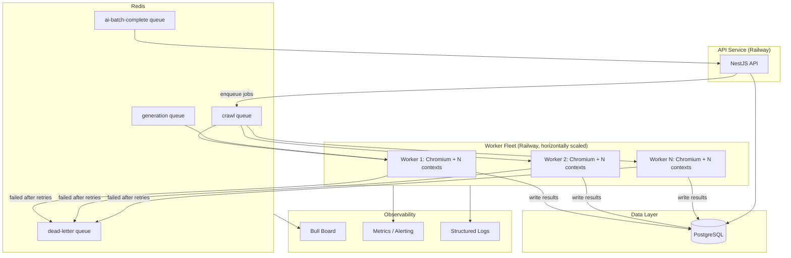

# Capacity Planning & Infrastructure Analysis — Playwright Scraping Fleet

**Scope:** 100 agency scrapers/day, Playwright + Chromium in Docker, Railway (8 vCPU / 8 GB RAM).
**Grounded against current implementation** in `api/src/integrations/crawler/` and `api/src/background/crawl.processor.ts` — see [Current Implementation vs. Target](#0-current-implementation-vs-target) before trusting any number below as "as-built."

---

## Executive Summary

- The current 8 vCPU / 8 GB Railway box is **adequate, not underpowered**, for 100 agencies/day at the codebase's existing default concurrency of 5. Total wall-clock to run all 100 jobs sequentially in one worker at concurrency 5 is **~5 hours**, leaving ~19 hours of daily headroom for retries, re-runs, and freshness passes.
- The binding constraint on this box is **CPU, not RAM**. RAM has room up to roughly concurrency 20 (~6.2 GB); CPU saturates well before that (~concurrency 12–14 theoretical, ~8–10 practical safe ceiling).
- The single biggest structural gap versus the target architecture already sketched in `docs/playwright-scraping-worker-architecture.md` is that **the API and the scrape worker currently run in the same container/process** (one `Dockerfile`, one Railway service, no `docker-compose.yml`, no dedicated worker service). Horizontal scaling (multiple worker containers pulling from the same BullMQ queue) is not yet possible without splitting this out.
- Recommendation: raise `CRAWL_WORKER_CONCURRENCY` from 5 → **8**, keep everything else as-is for the 100-agency scale, and split the worker into its own Railway service **before** agency count crosses roughly 250–500, since that's where a single box stops comfortably absorbing retries and freshness re-runs within a day.

---

## 0. Current Implementation vs. Target

This matters because most of the report's numbers depend on *which* architecture is actually running.

| Aspect | Currently implemented | Target (per `docs/playwright-scraping-worker-architecture.md`) |
|---|---|---|
| Browser model | ✅ One shared Chromium singleton (`stealth-browser.service.ts`), relaunched on disconnect | Same — already matches target |
| Context isolation | ✅ New `BrowserContext` + `Page` per job, closed after use | Same — already matches target |
| Queue | ✅ BullMQ + Redis, queues: `generation`, `crawl`, `ai-batch-complete` (`queues.constants.ts`) | Same |
| Worker concurrency | ✅ `CRAWL_WORKER_CONCURRENCY` env, default **5** (`crawler.constants.ts:9-11`) | Same mechanism, target suggests 5–10 |
| Detail-page concurrency | ✅ `CRAWL_DETAIL_CONCURRENCY` env, default **3**, nested inside each crawl job | Not explicitly discussed in target doc |
| Worker process separation | ❌ Worker runs **in-process** with the API (single `main.ts`, single `Dockerfile`, single `railway.toml`) | ❌ Not yet — target calls for independent worker containers |
| Horizontal scaling | ❌ Not possible yet — no second service/container to add | ❌ Not yet implemented |
| Dead-letter queue | ⚠️ Not confirmed in the queue processors reviewed | ❌ Not yet implemented |
| Monitoring/alerting | ⚠️ Bull Board UI exists (`bull-board.module.ts`) for queue visibility; no metrics/alerting confirmed | ❌ Not yet implemented |
| Agency scrapers | Stored as DB rows (`SourceAgency` → `Scraper` → `ScraperVersion.config`), not static config files — so **live agency count is a production-data question**, not verifiable from code | — |

All calculations below assume the **currently implemented** shared-browser, context-per-job model, since that's what would actually run in production today.

---

## Assumptions

Where exact values aren't derivable from the code, these are explicit engineering estimates — flagged wherever used:

1. **Per-job duration**: 15 minutes average (given), assumed roughly uniform across agencies for capacity math (real-world variance — retries, slow sites — is handled via headroom, not modeled per-agency).
2. **Chromium base process**: ~150 MB RAM at idle (published headless Chromium baseline).
3. **Per active context**: ~300 MB RAM (real-estate listing pages: images, moderate JS, pagination) — mid-range for a content-heavy but not video-heavy page. Detail-page sub-jobs (`CRAWL_DETAIL_CONCURRENCY=3`) are short-lived and lighter; modeled separately below.
4. **CPU per active context**: ~0.5 vCPU average sustained during navigation + extraction, with momentary bursts toward 1.0 vCPU during page load/JS execution. This is the single most consequential assumption in this report — real sites vary 2–3x on either side depending on JS weight and anti-bot challenge complexity.
5. **API + Node/OS overhead**: ~1 vCPU / ~1 GB reserved off the top, since the API (NestJS, Prisma, HTTP handling, the separate AI computer-use pipeline) shares the same container as the crawl worker today.
6. **Redis and PostgreSQL** are assumed to run as separate Railway services/add-ons, not competing for the 8 vCPU / 8 GB box's resources (consistent with `REDIS_URL`/Prisma being externally configured, not local processes in the Dockerfile).
7. Railway compute billing assumed usage-based (vCPU-min + GB-min); exact current rates should be checked against Railway's pricing page before treating the cost section as more than directional.

---

## 1. Chromium Resource Usage by Concurrency Level

Because the current architecture uses **one shared Chromium process** with **one context+page per concurrent job** (not one browser per job), "browser instances" stays at 1 regardless of concurrency — the variable that actually scales is **contexts**. Detail-page enrichment adds up to `CRAWL_DETAIL_CONCURRENCY` (3) short-lived extra pages per in-flight job; shown separately as "peak pages" since they don't all overlap for the full 15 minutes.

| Concurrency | Chromium processes | Contexts | Peak pages (main + detail) | Est. RAM | Est. CPU (avg) | Utilization (of 8 vCPU / 8 GB, after 1 vCPU/1 GB reserved) |
|---|---|---|---|---|---|---|
| 1 | 1 | 1 | 1 + 3 = 4 | 0.45 GB | 0.5 vCPU | 8% CPU / 6% RAM |
| 2 | 1 | 2 | 2 + 6 = 8 | 0.75 GB | 1.0 vCPU | 14% CPU / 11% RAM |
| 3 | 1 | 3 | 3 + 9 = 12 | 1.05 GB | 1.5 vCPU | 21% CPU / 15% RAM |
| 4 | 1 | 4 | 4 + 12 = 16 | 1.35 GB | 2.0 vCPU | 29% CPU / 19% RAM |
| **5 (current default)** | 1 | 5 | 5 + 15 = 20 | 1.65 GB | 2.5 vCPU | 36% CPU / 24% RAM |
| 8 (recommended) | 1 | 8 | 8 + 24 = 32 | 2.55 GB | 4.0 vCPU | 57% CPU / 37% RAM |
| 10 | 1 | 10 | 10 + 30 = 40 | 3.15 GB | 5.0 vCPU | 71% CPU / 45% RAM |
| 15 | 1 | 15 | 15 + 45 = 60 | 4.65 GB | 7.5 vCPU | 107% CPU ⚠️ / 66% RAM |
| 20 | 1 | 20 | 20 + 60 = 80 | 6.15 GB | 10.0 vCPU | 143% CPU ⚠️ / 88% RAM |

**Reading this table:** RAM has generous headroom all the way to concurrency 20. **CPU is the real ceiling** — utilization crosses 100% of the 8-vCPU box (after reserving 1 vCPU for the API) somewhere between concurrency 10 and 15. Treat concurrency 15+ on this single box as unsafe in practice, not just "tight on paper" — sustained >90% CPU on a shared Node event loop + Chromium starves both the API and the browser's own rendering threads, producing timeouts and flaky extractions rather than a clean slowdown.

**Recommended browser strategy** — confirms what's already built, don't change it:

| Approach | Verdict for this workload |
|---|---|
| New browser per job | ❌ Rejected — ~150 MB + several seconds of launch overhead per job, wasted 100x/day for no isolation benefit contexts don't already provide |
| Shared browser + context per job | ✅ **Current implementation.** Best fit: near-full isolation (cookies/storage/auth) at a fraction of the process overhead |
| Multiple pages, no context isolation | ❌ Rejected — pages in the same context share cookies/storage, risking cross-agency session bleed |
| Browser pooling (pool of N browser processes) | ⚠️ Only worth it past the point where a single Chromium process's internal contention (GPU proc, network service) becomes the bottleneck — not the case yet at concurrency ≤10. Revisit if horizontal worker scaling (§5) still shows single-process contention under load testing |

---

## 2. Daily Scheduling — Comparison Table

Total work = 100 jobs × 15 min = **1,500 job-minutes/day**. Wall-clock = `ceil(100 / concurrency) × 15 min`.

| Concurrency | Batches | Wall-clock time | Jobs/hour | Idle time remaining (of 24h) | Fits in 24h? |
|---|---|---|---|---|---|
| 1 | 100 | 25.0 h | 4 | **−1.0 h** | ❌ No — overruns by 1 hour |
| 2 | 50 | 12.5 h | 8 | 11.5 h | ✅ Yes |
| 3 | 34 | 8.5 h | 12 | 15.5 h | ✅ Yes |
| 4 | 25 | 6.25 h | 16 | 17.75 h | ✅ Yes |
| **5 (current)** | 20 | 5.0 h | 20 | 19.0 h | ✅ Yes, comfortably |
| **8 (recommended)** | 13 | 3.25 h | 31 | 20.75 h | ✅ Yes, very comfortably |
| 10 | 10 | 2.5 h | 40 | 21.5 h | ✅ Yes |
| 15 | 7 | 1.75 h | 57 | 22.25 h | ⚠️ Yes on paper, but CPU-unsafe (see §1) |
| 20 | 5 | 1.25 h | 80 | 22.75 h | ⚠️ Yes on paper, but CPU-unsafe (see §1) |

At today's 100-agency scale, concurrency is not the bottleneck for *fitting the work into a day* — even concurrency 1 nearly fits, and concurrency 2 already clears it with headroom. The reason to run higher than 2–3 isn't "otherwise it won't finish," it's **freshness and retry budget**: finishing the full run in 3–5 hours instead of 12–25 leaves the rest of the day for re-scraping failures, running multiple freshness passes, or absorbing agency-count growth without re-architecting.

---

## 3. Optimal Scheduling Plan

Options considered:

| Strategy | Assessment |
|---|---|
| 1 scraper every 15 min (concurrency 1) | Simplest, but wastes 7 of 8 vCPUs the whole day and barely fits in 24h with zero retry margin. Reject. |
| 2–4 scrapers every 15 min | Safe, but under-uses the box and still leaves little slack for a full retry pass. |
| **Continuous queue processing at concurrency 8** | **Recommended.** Enqueue all 100 jobs at once (e.g., 00:00), let BullMQ's worker concurrency (8) pull continuously until drained (~3.25h), then idle until the next day's trigger or on-demand re-runs. Matches how `CrawlProcessor` already works — no scheduler logic needed beyond "enqueue once daily." |
| Fixed interval batches (e.g., 5 every 15 min) | Equivalent throughput to continuous processing at the same concurrency, but adds unnecessary scheduling complexity (a cron trigger per batch) for no benefit — BullMQ already handles draining a queue at a fixed concurrency without manual batching. |
| Dynamic scheduling (priority/agency-tier aware) | Not justified at 100 agencies. Revisit at the 500–1,000 agency tier (§5) once some agencies need fresher data than others or retries need to jump the queue. |

**24-hour timeline at concurrency 8:**

```
00:00  Enqueue all 100 agency crawl jobs (single BullMQ batch enqueue)
00:00–03:15  Worker drains queue at concurrency 8 (~13 batches × 15 min)
03:15–04:00  Automatic retries for any failed jobs (BullMQ backoff, small remaining queue)
04:00–24:00  Idle / available for: on-demand re-scrapes, a second freshness pass,
             AI scraper-generation jobs (`generation` queue), ai-batch-complete processing
```

Running the batch overnight (00:00 start) avoids competing with any daytime API traffic on the same container, which matters *specifically because* the worker and API share a process today (§0).

---

## 4. Railway Capacity Analysis (8 vCPU / 8 GB)

| Metric | Estimate |
|---|---|
| Avg RAM per active context | ~300 MB |
| Peak RAM at safe concurrency (8) | ~2.55 GB scraping + ~0.3–0.5 GB API/Node/OS ≈ **~3 GB of 8 GB** |
| CPU while actively scraping at concurrency 8 | ~4.0 vCPU scraping + ~1 vCPU API/OS ≈ **~5 of 8 vCPU (~63%)** |
| Maximum safe concurrent contexts | **8–10** (RAM allows more; CPU is the limiter — see §1) |
| Expected CPU utilization at recommended concurrency (8) | ~57–63% sustained, bursting higher during simultaneous page loads |
| Expected RAM utilization at recommended concurrency (8) | ~35–40% |
| Remaining headroom at concurrency 8 | ~3 vCPU, ~5 GB RAM |

**Verdict: Adequate, not underpowered — arguably a little generous for today's 100-agency load.** RAM in particular is over-provisioned relative to what this specific workload needs; CPU has comfortable but not excessive headroom. The box is well-sized to absorb a move from concurrency 5 → 8 and to absorb agency-count growth into the 250-agency range without any hardware change. It stops being "adequate" once either (a) concurrency needs to push past ~10 to hit freshness targets, or (b) agency count grows enough that even a comfortable concurrency can't drain the queue with retry margin — see §5.

---

## 5. Scaling Analysis

Total daily work = agencies × 15 min. Recommended concurrency assumes the current shared-browser-per-container model unless a structural change is called out.

| Agencies | Job-minutes/day | At concurrency 8 (single box) | Structural change needed? |
|---|---|---|---|
| 100 (today) | 1,500 | 3.25 h wall-clock | None. Current single-service setup is fine. |
| 250 | 3,750 | 7.8 h wall-clock | None yet — still fits in a day with retry margin on the same box/concurrency. |
| 500 | 7,500 | 15.6 h wall-clock | **Recommended**: split the worker out of the API container into its own Railway service (finally implementing the target architecture in `docs/playwright-scraping-worker-architecture.md`), and/or push concurrency to 10–12 on a slightly larger box. Single-box CPU margin is getting thin once retries and detail-page load are added on top of 15.6h. |
| 1,000 | 15,000 | Even at an unsafe concurrency 15–20, ~14–17h, with degraded reliability | **Required**: horizontal scaling — 3–4 independent worker services (each ~8 vCPU/8 GB, concurrency ~6–8) pulling from the same BullMQ queue. Aggregate concurrency ~24–32 → wall-clock ~8–10h with real retry margin. Needs: dedicated Redis sized for the higher job throughput, per-worker health checks, queue-depth monitoring. |
| 5,000 | 75,000 | N/A on any fixed box | **Required**: full autoscaled worker fleet (10–15 containers, aggregate concurrency ~80–120, ~12.5h wall-clock), queue partitioning (e.g., by agency tier/region to isolate noisy/slow sites), explicit retry queues + dead-letter queues (not yet implemented anywhere in the codebase reviewed), Postgres tuned for 50x the write volume (connection pooling, possibly read replicas for reporting), and real monitoring/alerting on queue depth and failure rate rather than just Bull Board's UI. |

The inflection points worth remembering: **~250 agencies** is roughly where "just raise concurrency" stops being sufficient reasoning on its own (margin gets thin), and **~500–1,000 agencies** is where a single container structurally can't be pushed further and horizontal worker scaling — not yet implemented — becomes mandatory rather than optional.

---

## 6. Production Architecture

### Current state (matches code reviewed)

```
┌─────────────────────────────────────────────────────────┐
│              Single Railway Service (api/)                │
│                                                             │
│   ┌─────────────┐        ┌───────────────────────────┐   │
│   │  NestJS API  │        │   CrawlProcessor (BullMQ)  │   │
│   │  (HTTP)      │        │   concurrency = 5           │   │
│   └──────┬───────┘        │   → StealthBrowserService   │   │
│          │                │      (1 shared Chromium)     │   │
│          │                │   → 1 context+page per job   │   │
│          │                └──────────────┬────────────┘   │
└──────────┼───────────────────────────────┼────────────────┘
           │                               │
           ▼                               ▼
     PostgreSQL (Prisma)              Redis (BullMQ queues:
     SourceAgency/Scraper/            generation, crawl,
     ScraperVersion/results           ai-batch-complete)
```

### Recommended target (once agency count justifies §5's inflection point)

**Mermaid:**



**Component notes:**

- **API service**: unchanged — enqueues crawl jobs, serves the product, handles the AI computer-use scraper-generation pipeline.
- **Redis / BullMQ**: already implemented for the 3 existing queues; add an explicit dead-letter queue for jobs that exhaust retries, so failures are inspectable rather than silently dropped.
- **Worker fleet**: the structural change — extract `CrawlProcessor` + `StealthBrowserService` into their own deployable (own `Dockerfile`/Railway service), so Railway (or manual ops) can run N replicas, each independently holding one shared Chromium process and its own concurrency setting, all pulling from the same `crawl` queue. BullMQ handles job distribution across replicas automatically.
- **PostgreSQL**: unchanged structurally; revisit pooling/read replicas only at the 1,000–5,000 agency tier.
- **Observability**: Bull Board already covers queue-level visibility; add metrics/alerting (queue depth, failure rate, per-job duration) before scaling past a single worker service, since that's the point where "eyeball the dashboard" stops being sufficient.

---

## 7. Best Practices

Calibrated against what's already implemented vs. genuine gaps:

| Practice | Status | Note |
|---|---|---|
| Shared browser, context-per-job | ✅ Already correct | Keep as-is |
| Context/page closed after each job | ✅ Already correct (`diagnostics-capture.service.ts`) | Keep as-is |
| Navigation/selector timeouts | ✅ Already configured (`PAGE_TIMEOUT_MS`, `SELECTOR_TIMEOUT_MS`) | Keep as-is |
| Browser auto-relaunch on disconnect | ✅ Already implemented | Keep as-is |
| **Periodic proactive Chromium restart** | ⚠️ Not confirmed | A long-lived shared Chromium process accumulates memory over hundreds of context cycles even with careful cleanup. Recommend restarting the browser process every N jobs or on a memory threshold, not only reactively on crash. |
| **Retry / exponential backoff** | ⚠️ Not confirmed in reviewed processors | Verify BullMQ `attempts` + `backoff` are configured on the `crawl` queue's job options, not just default (no-retry) behavior. |
| **Dead-letter queue** | ❌ Not implemented | Add one — jobs that exhaust retries should land somewhere inspectable, not just disappear as "failed" in Bull Board. |
| **Proxy support / rotation** | ❌ Not confirmed | Anti-bot risk grows with agency count; not urgent at 100 agencies but becomes relevant well before the 1,000+ tier. |
| **Rate limiting per target site** | ❌ Not confirmed | Distinct from queue concurrency — protects individual agency sites from being hammered if a job retries rapidly. |
| **Metrics/alerting beyond Bull Board** | ❌ Not implemented | Bull Board is a UI you have to look at; add alerting on queue depth and failure-rate thresholds so problems surface without someone checking the dashboard. |
| Structured logging with job context | ✅ Implied by `crawler-debug.service.ts` | Keep as-is; confirm job ID/agency ID are always present in log lines. |

**Common mistakes this architecture already avoids**: launching a fresh browser per job, reusing contexts across unrelated jobs, unbounded concurrency. **Common mistakes to keep avoiding as scale grows**: letting a single shared Chromium process run indefinitely without restarts, treating Bull Board as sufficient alerting, and scaling concurrency on one box past the CPU ceiling in §1 instead of scaling out.

---

## 8. Cost Optimization

*Directional estimates only — confirm against Railway's current published rates before budgeting.*

| Comparison | Recommendation for this workload |
|---|---|
| Higher concurrency vs. lower | Higher concurrency (up to the ~8–10 safe ceiling) is strictly cheaper per job here: the box is billed whether or not it's idle, so finishing the daily batch in 3.25h at concurrency 8 instead of 25h at concurrency 1 doesn't cost more compute-time overall — it's the same total job-minutes, just less wall-clock. The only cost tradeoff is if you'd otherwise scale the box *down* during idle hours, which Railway's usage-based billing already does implicitly for compute (not for a fixed monthly service minimum, if one applies to the plan in use). |
| Larger single server vs. multiple smaller workers | At 100–250 agencies, a single 8 vCPU/8 GB box is cheaper (one service, no redundant baseline overhead). Past ~500 agencies (§5), multiple smaller workers become worth it not primarily for cost but for **reliability and horizontal headroom** — losing one of three workers degrades throughput by a third instead of taking the whole crawl fleet down. |
| Single worker vs. multiple workers | Single, until the §5 inflection point. Splitting early adds Railway service overhead (each service has its own baseline) for no capacity benefit at this scale. |
| Always-on vs. autoscaling workers | The crawl workload is bursty (few hours/day of heavy use, then idle) — if Railway's plan supports scale-to-zero or usage-based idle billing for the worker service, an autoscaled/on-demand worker (triggered by queue depth) is more cost-efficient than an always-on box sitting idle ~21 of 24 hours at today's scale. Worth revisiting once the worker is split out as its own service (§6), since that's what makes independent scaling policies possible in the first place. |

Rough monthly compute envelope at concurrency 8, ~3.25h/day active + idle baseline on one Railway service, is a small fraction of a full 24/7 8 vCPU/8 GB allocation *if* Railway's usage-based compute billing (not a fixed always-on price) applies — check the current plan's billing model before assuming which of these applies.

---

## 9. Final Recommendation

| Question | Answer |
|---|---|
| Ideal concurrency (today, 100 agencies) | **8** (up from the current default of 5) |
| Max safe concurrent contexts on this box | 8–10; avoid 12+ (CPU-bound, §1) |
| Worker processes | 1 today; plan to split into an independent worker service before ~500 agencies |
| Browser architecture | Keep current: 1 shared Chromium + context-per-job. No change needed. |
| Queue configuration | Keep BullMQ/Redis; add dead-letter queue and verify retry/backoff config (§7 gaps) |
| Daily schedule | Single enqueue-all-100 batch, continuous drain at concurrency 8 (~3.25h), rest of day free for retries/freshness/generation jobs |
| Resource allocation | No hardware change needed at 100–250 agencies |
| Scaling strategy | Horizontal worker replicas behind the same BullMQ queue, required by ~500–1,000 agencies (§5) |
| Production deployment | Split API and worker into separate Railway services as the first structural step — everything else in this report assumes that eventually happens and gets easier once it does |

**Is the current 8 vCPU / 8 GB Railway server sufficient for production at 100 agencies/day?**

**Yes.** It's not just sufficient, it has comfortable headroom — the main action item isn't a bigger box, it's raising `CRAWL_WORKER_CONCURRENCY` to make better use of the box that's already there, and starting to plan (not yet execute) the API/worker service split so that the next 5–10x growth in agency count doesn't require an emergency re-architecture.
